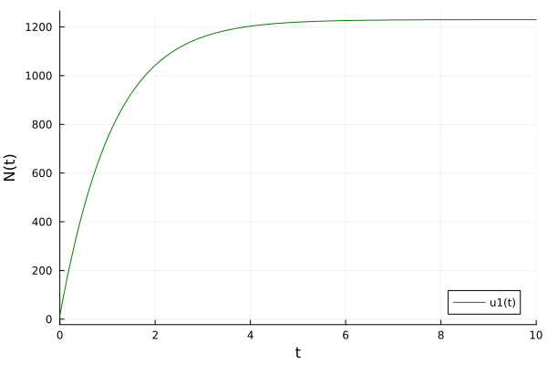
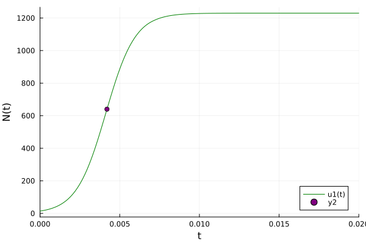
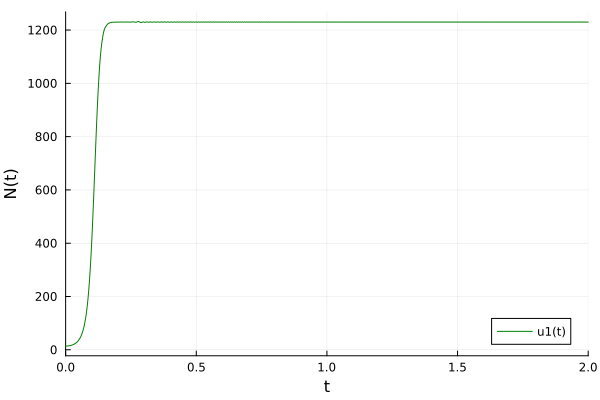
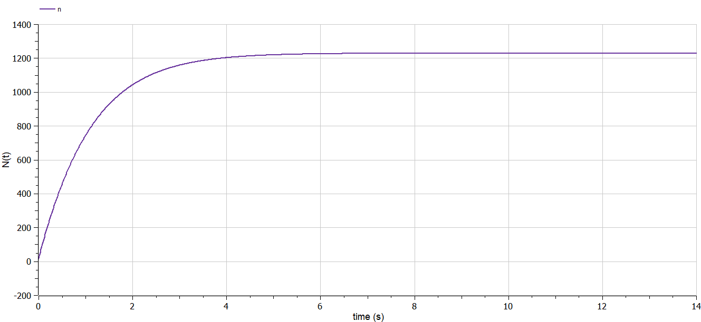
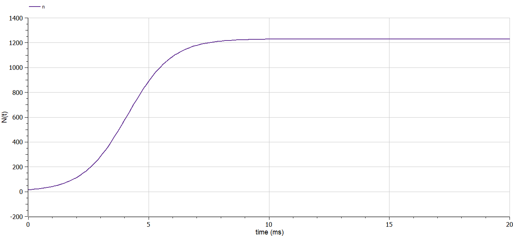
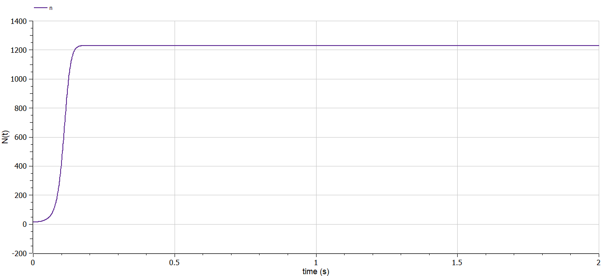
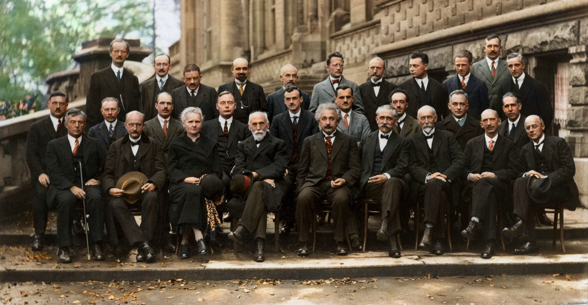

---
## Author
author:
  name: Дмитрий Сергеевич Кулябов
  degrees: DSc
  orcid: 0000-0002-0877-7063
  email: kulyabov-ds@rudn.ru
  affiliation:
    - name: Российский университет дружбы народов
      country: Российская Федерация
      postal-code: 117198
      city: Москва
      address: ул. Миклухо-Маклая, д. 6

## Title
title: "Шаблон отчёта по лабораторной работе"
subtitle: "Простейший вариант"
license: "CC BY"
---

# Цель работы

Здесь приводится формулировка цели лабораторной работы.---
## Front matter
title: "Лабораторная работа №7"
subtitle: "Эффективность рекламы"
author: "Разанацуа Сара Естэлл"

## Generic otions
lang: ru-RU
toc-title: "Содержание"

## Bibliography
bibliography: bib/cite.bib
csl: pandoc/csl/gost-r-7-0-5-2008-numeric.csl

## Pdf output format
toc: true # Table of contents
toc-depth: 2
lof: true # List of figures
lot: false # List of tables
fontsize: 12pt
linestretch: 1.5
papersize: a4
documentclass: scrreprt
## I18n polyglossia
polyglossia-lang:
  name: russian
  options:
	- spelling=modern
	- babelshorthands=true
polyglossia-otherlangs:
  name: english
## I18n babel
babel-lang: russian
babel-otherlangs: english
## Fonts
mainfont: PT Serif
romanfont: PT Serif
sansfont: PT Sans
monofont: PT Mono
mainfontoptions: Ligatures=TeX
romanfontoptions: Ligatures=TeX
sansfontoptions: Ligatures=TeX,Scale=MatchLowercase
monofontoptions: Scale=MatchLowercase,Scale=0.9
## Biblatex
biblatex: true
biblio-style: "gost-numeric"
biblatexoptions:
  - parentracker=true
  - backend=biber
  - hyperref=auto
  - language=auto
  - autolang=other*
  - citestyle=gost-numeric
## Pandoc-crossref LaTeX customization
figureTitle: "Рис."
tableTitle: "Таблица"
listingTitle: "Листинг"
lofTitle: "Список иллюстраций"
lotTitle: "Список таблиц"
lolTitle: "Листинги"
## Misc options
indent: true
header-includes:
  - \usepackage{indentfirst}
  - \usepackage{float} # keep figures where there are in the text
  - \floatplacement{figure}{H} # keep figures where there are in the text
---

# Цель работы

Исследовать модель эффективности рекламы. 

# Задание

Построить график распространения рекламы, математическая модель которой описывается
следующим уравнением:

1. $\dfrac{dn}{dt} = (0.88+0.00008n(t))(N-n(t))$

2. $\dfrac{dn}{dt} = (0.00008+0.88n(t))(N-n(t))$

3. $\dfrac{dn}{dt} = (0.7t+0.6sin(t)n(t))(N-n(t))$

При этом объем аудитории $N = 1230$, в начальный момент о товаре знает 14 человек. Для случая 2 определить в какой момент времени скорость распространения рекламы будет
иметь максимальное значение.

# Теоретическое введение

Пусть некая фирма начинает рекламировать новый товар. Необходимо, чтобы прибыль от будущих продаж покрывала издержки на дорогостоящую кампанию. Ясно, что вначале расходы могут превышать прибыль, поскольку лишь малая часть потенциальных покупателей будет информирована о новом товаре. Затем, при увеличении числа продаж, уже возможно рассчитывать на заметную прибыль, и, наконец, наступит момент, когда рынок насытится, и рекламировать товар далее станет бессмысленно.

Модель рекламной кампании основывается на следующих основных предположениях. Считается, что величина $\dfrac{dN}{dt}$ — скорость изменения со временем числа потребителей, узнавших о товаре и готовых купить его ($t$ — время, прошедшее с начала рекламной кампании, $N(t)$ – число уже информированных клиентов), — пропорциональна числу покупателей, еще не знающих о нем, т. е. величине $\alpha_1(t)(N_0 - N(t))$, где $N_0$ - общее число покупателей (емкость рынка),характеризует интенсивность рекламной кампании. Предполагается также, что узнавшие о товаре потребители распространяют полученную информацию среди неосведомленных, выступая как бы в роли дополнительных рекламных агентов фирмы. Их вклад равен величине $\alpha_2(t)N(t)(N_0-N(t))$, которая тем больше, чем больше число агентов. Величина $\alpha_2$ характеризует степень общения покупателей между собой [@stud].

В итоге получаем уравнение

$$\dfrac{dn}{dt} = (\alpha_1+\alpha_2 n(t))(N-n(t))$$

# Выполнение лабораторной работы

## Реализация на Julia

Подключаем нужные библиотеки для решения ДУ и для отрисовки графиков. Задаем само дифференциальное уравнение, а также начальные условия и параметры. Определяем `ODEProblem`.

```Julia
using DifferentialEquations, Plots;
f(n, p, t) = (p[1] + p[2]*n)*(p[3] - n)
p1 = [0.88, 0.00008, 1230]
p2 = [0.00008, 0.88, 1230]
n_0 = 14
tspan1 = (0.0, 14.0)
tspan2 = (0.0, 0.02)
prob1 = ODEProblem(f, n_0, tspan1, p1)
prob2 = ODEProblem(f, n_0, tspan2, p2)
```

Когда задача определена, можем ее решить методом `solve()` и нарисовать график с помощью `plot()`.

```Julia
sol1 = solve(prob1, Tsit5(), saveat = 0.01)
plot(sol1, markersize =:15, c =:green, yaxis = "N(t)")
```
В результате получаем следующий график (рис. [-@fig:001]). Поскольку у нас $\alpha_1 >> \alpha_2$ мы получили модель Мальтуса. Видно, что когда значение покупателей становится 1230 - рынок насытился, и дальше реклама бесполезна.

{#fig:001 width=70%}

Теперь решим ДУ для второго случая и построим график.

```Julia
sol2 = solve(prob2, Tsit5(), saveat = 0.0001)
plot(sol2, markersize =:15, c=:green, yaxis="N(t)")
```

Нам требуется найти момент времени, в который скорость распространения рекламы имеет максимальное значение. Первая производная - показатель скорости, поэтому нам просто надо найти максимальное значение $\dfrac{dn}{dt}$ на заданном промежутке времени. 

Для начала просто вычислим все производные на $t\in[0, 0.2]$ с шагом 0.0001, получим вектор значений. С помощью команды `maximum()` найдем максимальный элемент из этого вектора:

```Julia
dev = [sol2(i, Val{1}) for i in 0:0.0001:0.02]
maximum(dev)
```
Получим значение `332697.90948582883`.

Далее найдем индекс этого элемента в векторе `dev`.

```Julia
findall(x -> x == 332697.90948582883, dev)

1-element Vector{Int64}:
 43
```

Поскольку шаг и интервал времени, на котором мы вычисляли производные, равны шагу и интервалу времени, на котором мы решали ДУ, то индексы в векторе `dev` совпадают с индексами в векторе `sol.t` и `sol.u`. То есть мы можем найти момент времени и значение N(t), когда скорость распространения рекламы максимальна. Для наглядности отразим это на графике (рис. [-@fig:002]).

```Julia
 x = sol2.t[43]
 y = sol2.u[43]
 scatter!((x,y), c=:purple, leg=:bottomright)
```

Получаем график, который является логистической кривой, поскольку $\alpha_1 << \alpha_2$.

{#fig:002 width=70%}

Для случая 3 задание ДУ и его решение выглядит так:

```Julia
function f3(u,p,t)
    n = u
    dn = (0.7*t + 0.6*sin(t)*n)*(1230 - n)
end
u_0 = 14
tspan = (0.0, 2)
prob = ODEProblem(f3, u_0, tspan)
sol = DifferentialEquations.solve(prob, Tsit5(), saveat = 0.001)
plot(sol, markersize =:15, c=:green, yaxis="N(t)")
```

В результате получаем следующий график (рис. [-@fig:003]).

{#fig:003 width=70%}

## Реализация на OpenModelica

**Случай 1**

Здесь мы задаем параметры, начальные условия, ДУ и выполняем симуляцию на том же интервале и с тем же шагом, что и в Julia.

```
  parameter Real a_1 = 0.88;
  parameter Real a_2 = 0.00008;
  parameter Real N = 1230;
  parameter Real n_0 = 14;
  
  Real n(start=n_0);

equation
  der(n) = (a_1 + a_2*n)*(N - n);
```

В результате получаем следующий график (рис. [-@fig:004]). Поскольку у нас $\alpha_1 >> \alpha_2$ мы получили модель Мальтуса. Видно, что когда значение покупателей становится 1230 - рынок насытился, и дальше реклама бесполезна.

{#fig:004 width=70%}

**Случай 2**

Задаем параметры, начальные условия, ДУ и выполняем симуляцию на том же интервале и с тем же шагом, что и в Julia.

```
  parameter Real a_1 = 0.00008;
  parameter Real a_2 = 0.88;
  parameter Real N = 1230;
  parameter Real n_0 = 14;
  
  Real n(start=n_0);

equation
  der(n) = (a_1 + a_2*n)*(N - n);
```

В результате получаем следующий график (рис. [-@fig:005]). Получаем график, который является логистической кривой, поскольку $\alpha_1 << \alpha_2$.

{#fig:005 width=70%}

Давайте посмотрим на график (рис. [-@fig:006]) изменения производной с течением времени. На графике четко виден максимум.

.png){#fig:006 width=70%}

Если мы наведем курсор на этот максимум на графике, можно увидеть значение и время (рис. [-@fig:007]). Значение немного отличается от того, что мы нашли в Julia (мы не можем по графике определить точное значение), но можно увидеть, что момент времени действительно равен `4.2 ms`.

_2.png){#fig:007 width=70%}

**Случай 3**

Задаем параметры, начальные условия, ДУ и выполняем симуляцию на том же интервале и с тем же шагом, что и в Julia.

```
  parameter Real a_1 = 0.7;
  parameter Real a_2 = 0.6;
  parameter Real N = 1230;
  parameter Real n_0 = 14;
  
  Real n(start=n_0);

equation
  der(n) = (a_1*time + a_2*sin(time)*n)*(N - n);
```
В результате получаем следующий график (рис. [-@fig:008])

{#fig:008 width=70%}

## Сравнение построения модели на Julia и в OpenModelica

Все графики получились идентичными. Что Julia, что OpenModelica справились с решением ДУ и построением графиков.

# Выводы

В результате выполнения данной лабораторной работы была исследована модель эффективности рекламы.

# Список литературы{.unnumbered}

::: {#refs}
:::
Формулировки цели для каждой лабораторной работы приведены в методических указаниях.

Цель данного шаблона --- максимально упростить подготовку отчётов по лабораторным работам.
Модифицируя данный шаблон, студенты смогут без труда подготовить отчёт по лабораторным работам, а также познакомиться с основными возможностями разметки Markdown.

# Задание

Здесь приводится описание задания в соответствии с рекомендациями методического пособия и выданным вариантом.

# Теоретическое введение

Здесь описываются теоретические аспекты, связанные с выполнением работы.

Например, в [табл. @tbl-std-dir] приведено краткое описание стандартных каталогов Unix.

| Имя каталога | Описание каталога                                                                                                          |
|--------------|----------------------------------------------------------------------------------------------------------------------------|
| `/`          | Корневая директория, содержащая всю файловую                                                                               |
| `/bin `      | Основные системные утилиты, необходимые как в однопользовательском режиме, так и при обычной работе всем пользователям     |
| `/etc`       | Общесистемные конфигурационные файлы и файлы конфигурации установленных программ                                           |
| `/home`      | Содержит домашние директории пользователей, которые, в свою очередь, содержат персональные настройки и данные пользователя |
| `/media`     | Точки монтирования для сменных носителей                                                                                   |
| `/root`      | Домашняя директория пользователя  `root`                                                                                   |
| `/tmp`       | Временные файлы                                                                                                            |
| `/usr`       | Вторичная иерархия для данных пользователя                                                                                 |

: Описание некоторых каталогов файловой системы GNU Linux {#tbl-std-dir}

Более подробно про Unix см. в [@tanenbaum_book_modern-os_ru; @robbins_book_bash_en; @zarrelli_book_mastering-bash_en; @newham_book_learning-bash_en].

# Выполнение лабораторной работы

Описываются проведённые действия, в качестве иллюстрации даётся ссылка на иллюстрацию ([рис. @fig-001]).

{#fig-001 width=70%}

# Выводы

Здесь кратко описываются итоги проделанной работы.


